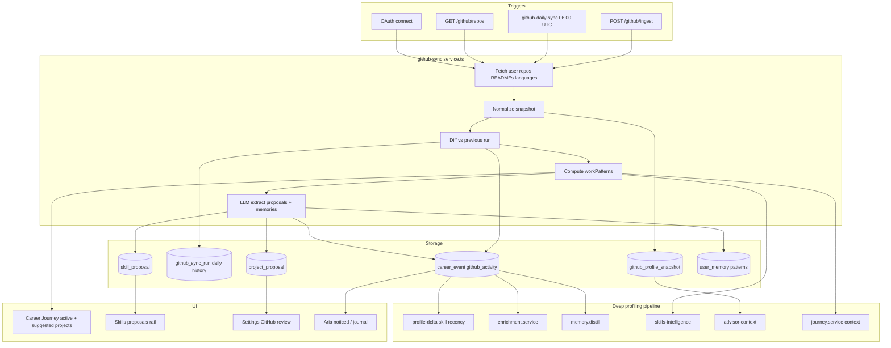

# GitHub Deep Profiling & Intelligence

## Goal

When a user **connects GitHub via OAuth** (existing Better Auth flow), Kursa should:

1. **Fetch and normalize** profile metadata, profile README, owned repos, per-repo READMEs, languages, and activity signals
2. **Re-sync every day** — diff against the previous snapshot to detect new pushes, repos, language/topic shifts, and work rhythm
3. **Learn work patterns** — commonly used frameworks/languages, active vs dormant repos, velocity, focus areas
4. **Feed deep profiling** — proposals, memories, profile deltas, skills intelligence, advisor context, journey generation
5. **Surface on Career Journey** — **Active projects** (what you're working on now) + **Suggested projects** (what to build next for your path)

Design constraints:
- **OAuth only** — token via [`getGitHubToken()`](apps/server/src/services/github-sync.service.ts). No URL-based scraping.
- **Confirm-first UX** — new skills/projects from GitHub land as proposals until accepted.

---

## Current state (baseline)

- OAuth → `GET /user/repos` → manual repo picker → **direct** `Project` + `Skill` writes
- No READMEs, no daily sync, no work-pattern model
- `github_sync` events **bypass** enrichment/memory (`skipDelta`, `skipDistill`, `skipEnrich`)
- Career Journey ([`career-journey.tsx`](apps/web/src/components/dashboard/career-journey/career-journey.tsx)) has roadmap + action queue — **no project panels**
- BullMQ jobs exist ([`jobs/index.ts`](apps/server/src/jobs/index.ts)) but nothing GitHub-specific

---

## Target architecture



---

## Phase 1 — OAuth snapshot + daily delta sync

### 1.1 Extend [`github-sync.service.ts`](apps/server/src/services/github-sync.service.ts)

Add `buildGitHubSnapshot(token)` and `runGitHubIngest(userId)`:

| Data | GitHub API | Purpose |
|------|------------|---------|
| User profile | `GET /user` | bio, company, login, `html_url` |
| Owned repos | `GET /user/repos` (existing) | full repo list, `pushed_at`, language, topics |
| Profile README | `GET /repos/{login}/{login}/readme` | identity / stack signals |
| Repo READMEs | top **8** repos by `pushed_at` | framework/tool extraction |
| Repo languages | top **5** active repos | weighted language mix |
| Commit activity | `GET /repos/{owner}/{repo}/stats/commit_activity` | **top 3 active repos only** — weekly rhythm without hammering API |

### 1.2 Storage models

**`GitHubProfileSnapshot`** (latest state per profile):

```prisma
model GitHubProfileSnapshot {
  id              String   @id @default(uuid())
  profileId       String   @unique
  githubUsername  String
  githubUrl       String
  status          String   // pending | complete | failed
  normalized      Json     // profile, repos[], signals, workPatterns
  lastIngestedAt  DateTime?
  lastError       String?
  createdAt       DateTime @default(now())
  updatedAt       DateTime @updatedAt
}
```

**`GitHubSyncRun`** (append-only daily history for diffs):

```prisma
model GitHubSyncRun {
  id          String   @id @default(uuid())
  profileId   String
  ranAt       DateTime @default(now())
  status      String   // complete | failed | no_token
  delta       Json     // changes since previous run
  workPatterns Json    // snapshot of patterns at this run
  @@index([profileId, ranAt])
}
```

**`normalized.workPatterns`** (computed each run):

```typescript
{
  activeRepos: Array<{ name, url, pushedAt, language, topics }>  // pushed within 30d
  dormantRepos: string[]                                         // no push 180d+
  languageMix: Array<{ language, weight }>                       // weighted by recency
  topTopics: string[]                                            // frequency across active repos
  frameworkSignals: string[]                                     // from README + topics + package hints
  pushVelocity: "accelerating" | "steady" | "slowing" | "inactive"
  lastActiveAt: string                                           // max pushed_at
  weeklyCommitRhythm?: number[]                                  // 7-day bucket from stats API
}
```

**`delta`** (vs previous `GitHubSyncRun`):

```typescript
{
  newRepos: string[]
  newlyActiveRepos: string[]      // crossed into 30d window
  languageShifts: Array<{ language, direction: "up" | "down" }>
  newTopics: string[]
  significantPushes: Array<{ repo, previousPushedAt, currentPushedAt }>
}
```

### 1.3 Daily sync job

Add to [`jobs/index.ts`](apps/server/src/jobs/index.ts):

- Job name: `github-daily-sync`
- Schedule: `0 6 * * *` (daily 06:00 UTC)
- Task: [`runGitHubDailySync()`](apps/server/src/jobs/tasks.ts) in new [`tasks.ts`](apps/server/src/jobs/tasks.ts) handler

Logic:
1. Query profiles with `account.providerId = "github"` and valid token
2. For each user: `runGitHubIngest(userId)` — fetch → normalize → diff → persist `GitHubSyncRun`
3. If `delta` is non-empty: emit `github_activity` career event (see Phase 3)
4. If token expired: mark `GitHubProfileSnapshot.lastError`, set `connected: false` in status API
5. Rate-limit: stagger users (batch of 10, 2s pause) to respect GitHub API limits

Also trigger on:
- OAuth connect / first `GET /github/repos` (immediate full ingest)
- `POST /github/ingest` (manual, max 1/hr per user)

---

## Phase 2 — Confirm-first proposals

(Unchanged core, still required before profile mutations.)

- Add `github` to `SkillProposalSource` enum
- New `ProjectProposal` model + accept/dismiss API
- [`github-profile.extract.ts`](apps/server/src/lib/ai/github-profile.extract.ts) — skills, projects, memories from snapshot
- Deprecate direct writes in [`persistSync()`](apps/server/src/services/github-sync.service.ts)

**Daily sync + proposals**: on delta with new languages/topics, upsert **update_confidence** or **add** skill proposals (deduped). New repos → project proposals. User accepts on Skills page / Connections.

---

## Phase 3 — Deep profiling & intelligence integration

GitHub data must flow through the **same pipelines** as journal, chat, and check-ins — not sit in an isolated snapshot.

### 3.1 Career events

Add `github_activity` to `CareerEventType` (keep `github_sync` for batch proposal accepts).

Daily delta event (when `delta` non-empty):

```typescript
structured: {
  type: "github_daily_delta",
  newRepos: string[],
  newlyActiveRepos: string[],
  languageShifts: [...],
  pushVelocity: string,
  primaryLanguages: string[],
  topTopics: string[],
}
```

**Remove** `skipDelta`, `skipDistill`, `skipEnrich` for GitHub events.

### 3.2 Profile delta ([`profile-delta.ts`](apps/server/src/compute/profile-delta.ts))

On `github_activity` with active repos:
- Bump `Skill.lastUsedDate` for languages/topics matching active repos (source stays `github_import` after acceptance)
- Flag skills as **recently evidenced** when repo language aligns

### 3.3 Enrichment ([`enrichment.service.ts`](apps/server/src/services/enrichment.service.ts))

Add `github_activity` to enrichable types. LLM extracts:
- Work focus themes ("shipping frontend features", "infra tooling")
- Milestone relevance ("repo X demonstrates milestone 2 proof artifact")
- Memory candidates

### 3.4 Memory distillation ([`memory.distill.ts`](apps/server/src/compute/memory.distill.ts))

Rule-based facts from `workPatterns`:
- `"Primary stack shifting toward TypeScript (3 of 4 active repos)"`
- `"Consistent weekly commits on kursa — active builder signal"`
- Category: `skill_evidence` | `pattern`

### 3.5 Skills intelligence ([`skills-intelligence.service.ts`](apps/server/src/services/skills-intelligence.service.ts))

New recommendation source `github`:
- Skills in `languageMix` / `frameworkSignals` not on profile
- Boost priority when `pushVelocity === "accelerating"`
- Deprioritize skills only in `dormantRepos`

### 3.6 Advisor context ([`advisor-context.ts`](apps/server/src/lib/advisor-context.ts))

Add `githubSlice` when OAuth connected:

```typescript
{
  username, lastActiveAt, pushVelocity,
  activeRepoNames: string[],      // top 3
  primaryLanguages: string[],
  frameworkSignals: string[],
}
```

Feeds: observations, Aria chat ([`chat-context.ts`](apps/server/src/lib/chat-context.ts)), journey regeneration ([`journey.service.ts`](apps/server/src/services/journey.service.ts)).

### 3.7 Material change detection

When daily `delta` includes `languageShifts`, `newlyActiveRepos`, or `pushVelocity` change → set `materialChangeDetected: true` on observations response (already consumed by [`career-journey/page.tsx`](apps/web/src/app/dashboard/career-journey/page.tsx)) to prompt journey review.

### 3.8 Aria noticed / journal

Surface daily GitHub insights in [`aria-noticed.tsx`](apps/web/src/components/dashboard/aria-noticed.tsx):
- "You've been active on 2 repos this week"
- "New repo detected: {name}"
- Link to project proposals

---

## Phase 4 — Career Journey project surfaces

### 4.1 API extension

Extend [`CareerJourneyResponse`](packages/types/src/api/journey.ts) (via [`journey.service.ts`](apps/server/src/services/journey.service.ts) or new `journey-projects.service.ts`):

```typescript
interface JourneyActiveProject {
  id: string                    // profile project id or github repo id
  source: "profile" | "github"
  title: string
  url: string | null
  language: string | null
  topics: string[]
  lastPushedAt: string
  activityLabel: string         // "Active this week" | "Touched 12d ago"
  linkedMilestoneOrder?: number // if repo matches journey proofArtifacts
}

interface JourneySuggestedProject {
  id: string
  title: string
  rationale: string           // ties to milestone + skill gap + github patterns
  targetMilestoneOrder?: number
  suggestedSkills: string[]
  effort: "small" | "medium" | "large"
  source: "journey" | "github_patterns" | "market"
}
```

`GET /api/v1/profile/me/journey` returns `activeProjects` + `suggestedProjects` alongside existing `journey`, `timeline`, `actionQueue`.

### 4.2 Active projects logic

Merge two sources:
1. **GitHub** — repos from `workPatterns.activeRepos` (OAuth connected)
2. **Profile** — accepted `Project` rows with `endDate` recent or linked to active github repo

Sort by `lastPushedAt` desc. Show max 6 on journey page.

If no OAuth: show profile projects only with note to connect GitHub for live activity.

### 4.3 Suggested projects logic

LLM + rules ([`journey-suggested-projects.compute.ts`](apps/server/src/compute/journey-suggested-projects.compute.ts)):

**Inputs:**
- Active journey milestones + `skillGaps` + `proofArtifacts`
- `workPatterns` (what you build today)
- Past accepted projects (profile)
- Skills intelligence recommendations
- Market gaps (optional)

**Outputs:** 3–5 suggested projects, e.g.:
- "Build a small OSS tool in Rust to close your systems gap before milestone 3"
- "Document and publish your kursa repo README — matches proof artifact for milestone 2"

Cache suggestions 24h; invalidate on `materialChangeDetected` or journey regen.

### 4.4 UI components

Add to [`apps/web/src/components/dashboard/career-journey/`](apps/web/src/components/dashboard/career-journey/):

| Component | Content |
|-----------|---------|
| `journey-active-projects.tsx` | Cards: repo name, language, last push, link to GitHub; badge if linked to milestone |
| `journey-suggested-projects.tsx` | Rationale, target milestone, suggested skills, "Add to learning goals" / "Start project" CTA |

Place below roadmap in [`career-journey.tsx`](apps/web/src/components/dashboard/career-journey/career-journey.tsx), above action queue.

---

## Phase 5 — UI surfaces (Settings + Skills)

### Settings → Connections

Refactor [`github-import-section.tsx`](apps/web/src/components/dashboard/settings/github-import-section.tsx):
- OAuth-first; show last daily sync time + `pushVelocity` badge
- Proposal review for projects; link to Skills for skill proposals
- "Sync now" → `POST /github/ingest`

### Skills page

`github` source on proposals rail; sidebar badge includes github pending count.

### Onboarding

GitHub URL optional; note to connect OAuth in Settings after onboarding.

---

## Phase 6 — Other cool features (OAuth-powered roadmap)

Features to build **after** MVP, all using the daily snapshot + `workPatterns`:

| Feature | What it does |
|---------|----------------|
| **Weekly builder digest** | Aria summarizes what you shipped on GitHub this week → journal entry |
| **Milestone auto-match** | When active repo aligns with `proofArtifacts`, suggest marking milestone `in_progress` |
| **Stack vs market radar** | Compare `frameworkSignals` to market job skills for target role |
| **Consistency score** | Dashboard visibility metric from commit rhythm + push velocity |
| **README coach** | Score profile/repo READMEs vs target role; actionable rewrites |
| **Interview prep mode** | Aria generates talking points from recent repo activity + README outcomes |
| **Learning goal linker** | Suggest learning goals from repos you're actively pushing to |
| **OSS credibility badge** | Profile badge when stars/forks/recency cross thresholds |
| **Resume bullet autogen** | Pull outcomes from active repo READMEs into resume engine |
| **Career graph nodes** | Top active repos as live nodes on career graph with recency glow |
| **Dependency drift alert** | Parse `package.json` from active repos; flag outdated / security signals |
| **Private repo summary** | OAuth sees private repos — activity counts without exposing code in UI |
| **Application tailoring** | When applying to a job, highlight repos whose topics match JD keywords |
| **GitHub webhooks** | Real-time re-ingest on push (reduces daily-only lag for power users) |
| **Collaboration signal** | Contributor stats on repos → soft-skill evidence for leadership path |

---

## Migration notes

- Single code path: all GitHub API via OAuth token in [`github-sync.service.ts`](apps/server/src/services/github-sync.service.ts)
- Token expiry: graceful degrade — journey shows profile projects only; status prompts re-auth
- API budget: daily job processes ~N users/min; commit_activity only for top 3 active repos
- Tests: delta diff unit tests, workPatterns compute, journey active/suggested project fixtures, intelligence pipeline integration test with mock `github_activity` event

---

## Suggested implementation order

1. Schema: `GitHubProfileSnapshot`, `GitHubSyncRun`, `ProjectProposal`, `github` proposal source
2. Extend `github-sync.service.ts` — snapshot, diff, `workPatterns`
3. Daily BullMQ job + initial ingest on OAuth connect
4. LLM extract → proposals + memories; deprecate direct `persistSync` writes
5. Intelligence wiring (events, profile-delta, enrichment, distill, skills-intelligence, advisor-context)
6. Journey API + active/suggested projects UI on Career Journey
7. Connections UI + `GET /github/status`
8. Aria noticed integration + `materialChangeDetected` from deltas
