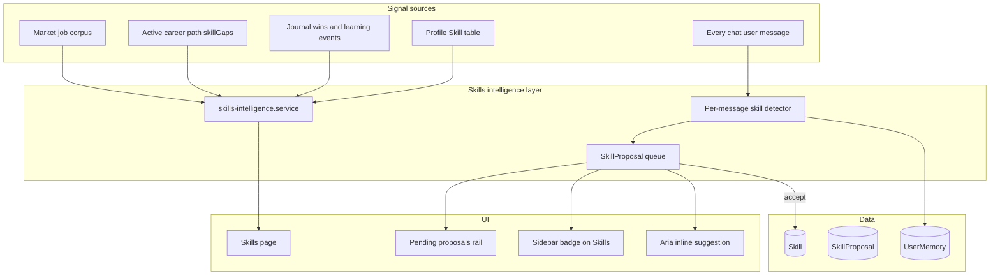

# Skills intelligence and deeper chat learning

## Current state (gaps)

| Area | Today | Gap |
|------|--------|-----|
| **Skills page** | Sidebar links to `/dashboard/skills` but **no page** exists | [`sidebar.tsx`](apps/web/src/components/dashboard/sidebar.tsx) vs missing `apps/web/src/app/dashboard/skills/` |
| **Skill CRUD** | Only onboarding `deleteMany` + `createMany` | No REST like social-links; `PUT /profile/me` ignores skills |
| **Chat learning** | Selective memories via [`chat-learn.service.ts`](apps/server/src/services/chat-learn.service.ts); **no `Skill` rows** | Skips decision threads, short messages, daily cap, LLM `shouldPersist` |
| **Recommendations** | Path LLM `skillGaps`, stale skills in path pulse; market `missing` gaps **broken** ([`skillFrequencyFromTitles`](apps/server/src/services/market-ingest.service.ts) only matches existing profile names) | No single “skills intelligence” API or UI |
| **Confirm UX** | None | User wants Skills-sidebar proposals with “+ add” |

Landing mock [`mocks/skills.tsx`](apps/web/src/components/mocks/skills.tsx) is the visual target for the real page.

---

## Product architecture



---

## 1. Data model

**Extend enums** in [`global.prisma`](packages/db/prisma/schema/models/global.prisma) / [`memory.prisma`](packages/db/prisma/schema/models/memory.prisma):

- `SkillSource`: add `inferred_chat`, `market`, `path`, `user_edited`

**New model `SkillProposal`** (map `skill_proposal`):

| Field | Purpose |
|-------|---------|
| `profileId`, `userId` | Ownership |
| `canonicalName` | Normalized skill label (title case via taxonomy) |
| `displayName` | Original phrase from chat |
| `category` | `technical` \| `soft` \| `tool` |
| `proposalType` | `add` \| `update_confidence` \| `mark_learning` \| `mark_stale` |
| `suggestedConfidence` | 1–5 optional |
| `suggestedProficiency` | optional |
| `source` | `chat` \| `market` \| `path` \| `journal` |
| `sourceRef` | JSON: `{ conversationId, messageId }` etc. |
| `evidence` | Short user-facing sentence |
| `status` | `pending` \| `accepted` \| `dismissed` |
| `expiresAt` | Auto-dismiss after 30d |

Unique partial index: one **pending** proposal per `(profileId, canonicalName, proposalType)` to avoid spam.

**Optional v1.1:** `Profile.preferences.autoAddSkillsAboveConfidence` (default false) — only if you want a settings toggle later; v1 ships **confirm-only**.

---

## 2. Skills intelligence service (backend brain)

New [`apps/server/src/services/skills-intelligence.service.ts`](apps/server/src/services/skills-intelligence.service.ts) + pure compute [`apps/server/src/compute/skills-intelligence.compute.ts`](apps/server/src/compute/skills-intelligence.compute.ts).

**`getSkillsOverview(userId)`** returns:

```ts
{
  skills: UserSkill[];           // grouped by category, with stale flag
  recommendations: SkillRecommendation[];  // ranked learn next
  proposals: SkillProposalSummary[];       // pending
  learningGoals: LearningGoal[];
  signals: { profileCompleteness, staleCount, marketAlignedCount };
}
```

**Recommendation sources (merged + deduped):**

1. **Market** — Fix [`gap-analysis.compute.ts`](apps/server/src/compute/gap-analysis.compute.ts) + ingest: extract skill tokens from job title corpus (taxonomy + n-grams), not only profile skill names. Emit real `missing` gaps.
2. **Active path** — Read `skillGaps` from active [`CareerPath`](packages/db/prisma/schema) JSON (already LLM-generated in [`paths.generate.ts`](apps/server/src/lib/ai/paths.generate.ts)).
3. **Learning goals** — Overdue / in-progress goals not reflected as skills.
4. **Advisor signals** — `dormantHighValueSkills` from [`insight.compute.ts`](apps/server/src/compute/insight.compute.ts).
5. **Memories** — Recent `skill_evidence` facts not yet on profile.

Each recommendation: `{ skillName, reason, priority, source, cta: "add_skill" | "start_learning" }`.

Reuse normalization from [`resume-taxonomy.ts`](apps/server/src/lib/resume-taxonomy.ts) for canonical names (JavaScript vs javascript).

---

## 3. Skill CRUD API (mirror social-links pattern)

Add under [`apps/server/src/routes/v1/profile.ts`](apps/server/src/routes/v1/profile.ts):

| Method | Route | Behavior |
|--------|-------|----------|
| GET | `/profile/me/skills/overview` | `getSkillsOverview` |
| POST | `/profile/me/skills` | Create skill (`name`, `category`, `confidenceRating`, `proficiencyLevel`, `source`) |
| PUT | `/profile/me/skills/:id` | Update fields |
| DELETE | `/profile/me/skills/:id` | Remove skill |
| GET | `/profile/me/skill-proposals` | List pending (query `status`) |
| POST | `/profile/me/skill-proposals/:id/accept` | Apply proposal → upsert `Skill`, mark accepted |
| POST | `/profile/me/skill-proposals/:id/dismiss` | Mark dismissed |

Validators in new `skills.validator.ts`; controller `skills.controller.ts`; service `skills.service.ts` (CRUD + accept/dismiss logic).

**Accept `add` proposal:** `skill.create` with `source: inferred_chat`, default confidence from suggestion or 3.

**Accept `update_confidence`:** bump `confidenceRating` / `lastUsedDate`.

Wire [`apps/web/src/lib/api.ts`](apps/web/src/lib/api.ts) `api.skills.*`.

---

## 4. Deeper chat learning (two-track pipeline)

Refactor [`chat-learn.service.ts`](apps/server/src/services/chat-learn.service.ts):

### Track A — Skill detection (runs on **every** non-empty user message, including decision threads)

- New `extractSkillsFromChatMessage` in [`chat-learn.extract.ts`](apps/server/src/lib/ai/chat-learn.extract.ts) (fast model, JSON schema):
  - `skills: [{ name, category, action: "add" | "improve" | "learning", confidence, evidenceQuote }]`
- Rules pre-filter still skips empty/platitude-only.
- **No daily cap** on proposals (cap at ~5 pending per skill name instead).
- `createOrUpdateSkillProposals()` — writes `SkillProposal` rows, does **not** mutate `Skill` until accept.
- Return `skillProposalsCreated` from `runChatLearning` (sync or await with 3s timeout for chat response).

### Track B — Memory distillation (existing, substantive messages)

- Keep current gates for `UserMemory` (length, factual signal, daily cap, dedupe).
- Extend prompt to output structured `skill_evidence` aligned with Track A names.
- Optionally set `skipDistill: false` for `chat_insight` so journal distillation can pick up themes later (keep `skipDelta: true` to avoid duplicate learning goals).

### Chat API response

Extend [`ChatSendResponse`](packages/types/src/api/chat.ts):

```ts
memoriesLearned?: number;
skillProposals?: Array<{ id; displayName; evidence; proposalType }>;
```

Update [`aria-chat.tsx`](apps/web/src/components/dashboard/aria/aria-chat.tsx):

- Toast when proposals created: “Aria noticed a skill — review on Skills”
- Inline chip under assistant message: “Add JavaScript to your skills?” → links to `/dashboard/skills?highlight={proposalId}`

### Conversation digest

When digest runs, also emit proposals for skills mentioned across thread.

---

## 5. Skills page (full product UI)

**Route:** [`apps/web/src/app/dashboard/skills/page.tsx`](apps/web/src/app/dashboard/skills/page.tsx) (server: `requireOnboarded` + `serverFetch` overview).

**Layout** (based on mock, wired to data):

```
┌─────────────────────────────────────────────────────────────┐
│ PageHeader: Skills                                          │
├──────────────────────────────┬──────────────────────────────┤
│ Main (flex-1)                │ Right rail (300px)           │
│ • Your skills by category    │ Pending from Aria            │
│   - edit/delete per row      │  [JS] "You mentioned…" [+]  │
│   - confidence bars          │  [dismiss]                   │
│   - last used / stale badge  │                              │
│ • + Add skill (modal)        │ Recommended to learn         │
│                              │  (market + path + goals)       │
│ • Learning goals strip       │  [Add skill] [Add as goal]   │
└──────────────────────────────┴──────────────────────────────┘
```

**Components** (new under `apps/web/src/components/dashboard/skills/`):

- `skills-page-client.tsx` — state, mutations, optimistic updates
- `skills-inventory.tsx` — categorized list + inline edit sheet
- `skill-row.tsx` — name, category, confidence slider, last used
- `skills-recommendations.tsx` — ranked cards with reason strings
- `skills-proposals-rail.tsx` — pending queue with **+** and dismiss
- `add-skill-dialog.tsx` — manual add (same fields as onboarding)

**Edit flow:** click row → drawer with name (read-only if linked to achievements), category, confidence 1–5, proficiency, delete with confirm.

**Deep links:** `?highlight=proposalId` scrolls/highlights proposal in rail.

---

## 6. Sidebar and cross-app integration

- [`dashboard/layout.tsx`](apps/web/src/app/dashboard/layout.tsx): fetch pending proposal count (lightweight `GET .../skill-proposals?status=pending&limit=1` with total).
- [`sidebar.tsx`](apps/web/src/components/dashboard/sidebar.tsx): badge on **Skills** nav (like journal badge pattern).
- **Journal** [`journal-memories.tsx`](apps/web/src/app/dashboard/journal/journal-memories.tsx): link “Manage skills →” to skills page.
- **Career path** path pulse: “Close gap: X” links to skills page with recommendation query param.
- **Aria** meta: optional `pendingSkillProposals` count in [`chat.service.ts`](apps/server/src/services/chat.service.ts) `getChatMeta`.

---

## 7. Intelligence depth upgrades (supporting “understands more”)

| Change | File |
|--------|------|
| Fix market missing-skill detection | [`market-ingest.service.ts`](apps/server/src/services/market-ingest.service.ts), [`gap-analysis.compute.ts`](apps/server/src/compute/gap-analysis.compute.ts) |
| Include top recommendations in chat `USER_CONTEXT` | [`chat-context.ts`](apps/server/src/lib/chat-context.ts) — slim `skillsOverview: { stale, topRecommendations, recentProposals }` |
| Nightly job: path/market → proposals (no chat) | [`jobs/tasks.ts`](apps/server/src/jobs/tasks.ts) — `runSkillRecommendationSweep` |
| `graph-linker`: `resolveOrCreateSkill` only on **accept**, not auto | [`graph-linker.service.ts`](apps/server/src/services/graph-linker.service.ts) |

**Not in v1:** auto-writing profile skills from chat without confirmation; full taxonomy editor; skill graph visualization.

---

## 8. Types and docs

- [`packages/types/src/api/skills.ts`](packages/types/src/api/skills.ts) — `SkillsOverviewResponse`, `SkillProposal`, `SkillRecommendation`, CRUD payloads
- Export from [`packages/types`](packages/types/src/index.ts)
- [`docs/intelligence/SKILLS_AND_CHAT_LEARNING.md`](docs/intelligence/SKILLS_AND_CHAT_LEARNING.md) — user-visible behavior, where to verify memories vs skills vs proposals

---

## 9. Tests

| Test | Focus |
|------|--------|
| `skills-intelligence.compute.test.ts` | Merge/dedupe recommendations; market gap token extraction |
| `chat-learn.service.test.ts` (mocked LLM) | Platitude skipped; proposal created for “learning JavaScript”; no duplicate pending |
| `skills.service.test.ts` | Accept proposal creates Skill; dismiss leaves profile unchanged |
| Extend `market.test.ts` | Missing gaps from job titles |

---

## Implementation order (recommended)

1. **Schema + migration** (`SkillProposal`, `SkillSource` values)
2. **Skills CRUD + overview API**
3. **Skills page UI** (inventory + recommendations; empty proposals rail)
4. **Market gap fix + recommendation merge**
5. **Chat Track A (proposals) + API response + Aria chips/toast**
6. **Proposals rail + sidebar badge + accept/dismiss**
7. **Chat Track B tuning** (memory prompt alignment, optional digest proposals)
8. **Chat context enrichment + docs + tests**

---

## Verification (manual)

1. Tell Aria on Main: “I’m learning JavaScript to level up” → toast + proposal; Skills nav shows badge.
2. Open **Skills** → rail shows copy + **+** → accept → skill appears under Technical with `inferred_chat` source.
3. **Recommended** lists market/path gaps with reasons (not empty for tester2 with `targetRole`).
4. Edit confidence, delete skill, add skill manually — persists after refresh.
5. Dismiss proposal → badge count decreases; no skill row created.
6. Short “thanks” message → no proposal; substantive question without self-fact → no proposal.
